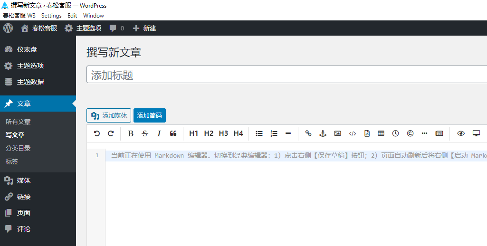

# CSKeFu W3 Desktop

春松客服 W3 服务桌面应用：专注提升工作效率。

下载地址：

* [Windows](http://cdndownload2.chatopera.com/installation/cskefu/cskefu-w3-2.25.3-win.exe)
* [macOS](http://cdndownload2.chatopera.com/installation/cskefu/cskefu-w3-2.25.3-mac.dmg)



## Build

### Install deps

```
scripts/install.sh
```

### Add icon

Place new icon in `static/icon.png`, run cmd `scripts/icon.sh`.

### Change App name in package.json

Set `name`, `productName`, `repository` and `description`.

### Change App ID namd

Edit `package.json`, set new string for `appId` and `build.appId`.

Change home url

Edit `package.json`, set new string for `appUrl`.

E.g.

```
  appUrl: "http://114.242.12.42:5300/",
```

### Generate new installer

```
scripts/build.sh
```

## Release new

[Doc](./original.README.md)
